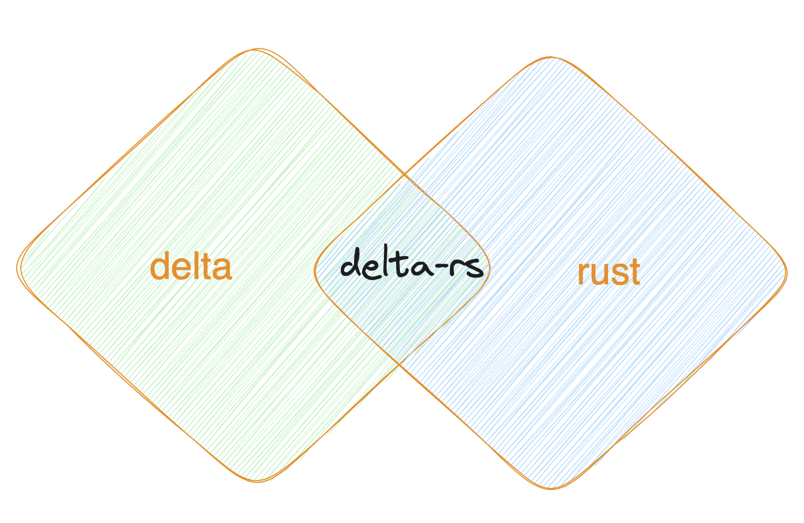

# data-engineering-rust-demo


Welcome to Data Enginnering Rust with Delta lake demo.



More details in the [Medium Blog](https://ajithshetty28.medium.com/delta-and-rust-new-in-town-ebe6dd012da8)
## Target Audience

Here we are target those who would like to get started with Rust and how to integrate with Delta Lake.

## Modules

In this project we have 2 modules.

1. [rusty-simple-delta](rusty-simple-delta)
2. rusty-aws-demo - will be added soon

## [rusty-simple-delta](rusty-simple-delta)

Install the rust
```
curl --proto '=https' --tlsv1.2 -sSf https://sh.rustup.rs | sh
```

Execute the source file
```
source "$HOME/.cargo/env"
```

````
cd rusty-simple-delta
````

````
cargo build
````

````
cargo run
````

The data will be stored under /data

Install below libs

```
python -m pip install deltalake
python -m pip pandas
```

To print we can use the python

```
python3 read.py
```
```
<bound method DeltaTable.schema of DeltaTable()>
            name  age
0     username-1    1
1     username-2    2
2     username-3    3
3     username-4    4
4     username-5    5
..           ...  ...
95   username-96   96
96   username-97   97
97   username-98   98
98   username-99   99
99  username-100  100
```

## More about Tokio
Tokio is an asynchronous runtime for the Rust programming language
https://tokio.rs/tokio/glossary